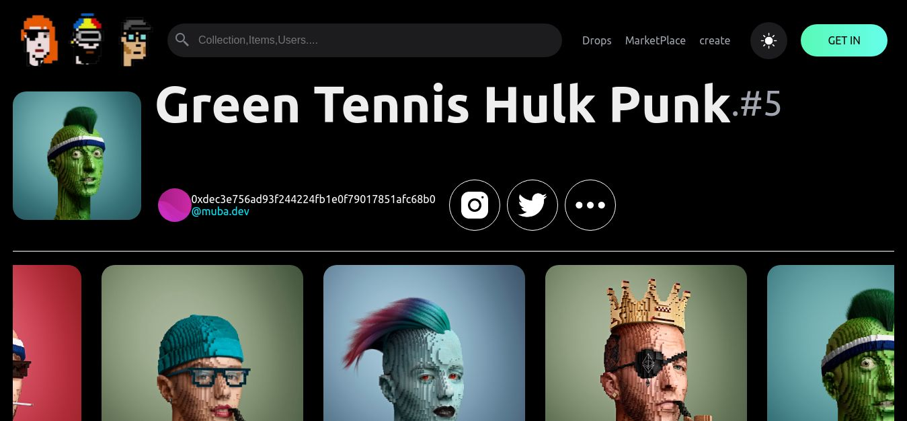

# Simple NFT React APP

## A Info Page for NFT created.

This project is created by creating to new NFT's in opensea Testnetwork and get api from and connect with the react app.

## Tools Used:

### ReactJs

### thirdweb

### opensea testnet(nft market)

